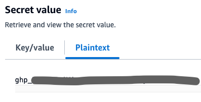
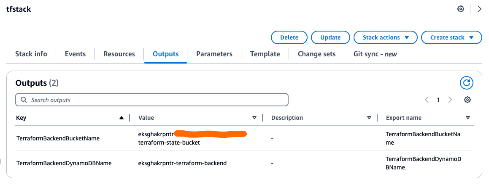
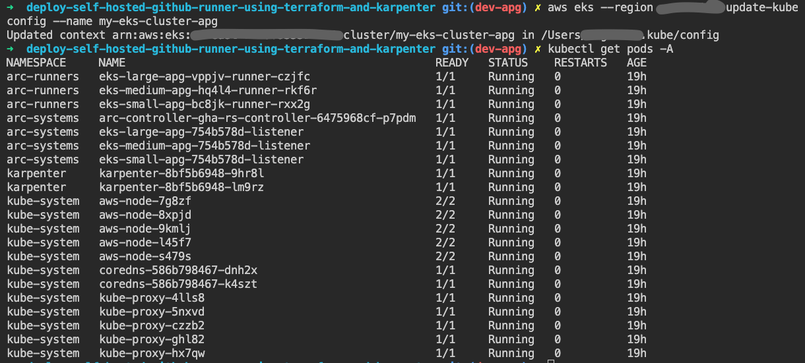
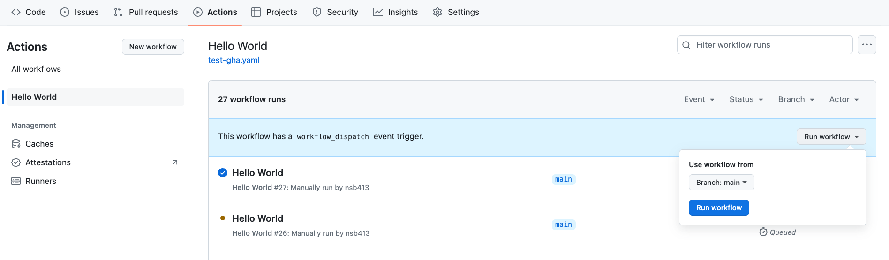
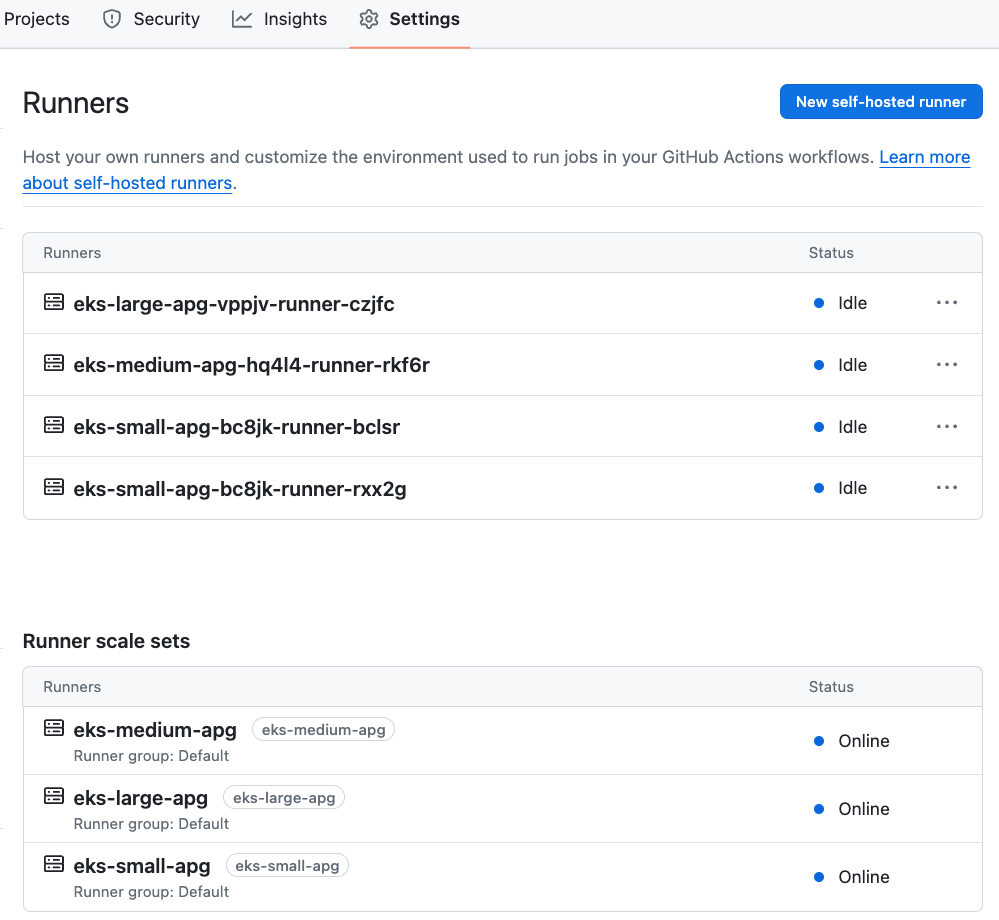

# EKS Based GitHub Self Hosted  Runner

## Overview

This repository can be used to provision an Amazon EKS cluster that can host different types of GitHub self-hosted Runners.

As per default configuration, it supports the  **3 different types** of runners with the following configuration,

| Runner-Name | minRunners | maxRunners | instance_type | cpu | memory |
| ----------- | ---------- | ---------- | ------------- | --- | ------ |
| eks-small   | 2          | 4          | t2.large      | 1   | 2Gi    |
| eks-medium  | 1          | 4          | t2.xlarge    | 1   | 4Gi    |
| eks-large   | 1          | 4          | t2.2xlarge    | 2   | 8Gi    |

** All the above parameters can be adjusted inside `terraform.tfvars` file based on self-hosted runners requirement. For more information, refer to the section `Input parameters`.

## Pre-Requisites

#### Create a GitHub repository

Create a GitHub repository or use an existing GitHub repository that you have access to, for testing this solution.

#### Install Kubectl

[kubectl](https://kubernetes.io/docs/tasks/tools/) is a Kubernetes command-line tool, allows you to run commands against Kubernetes clusters. You can use kubectl to deploy applications, inspect and manage cluster resources, and view logs. 

#### Install AWS CLI

AWS Command Line Interface (AWS CLI) installed and configured with your AWS account, so that you can create AWS resources by deploying an AWS CloudFormation stack. AWS CLI version 2 is recommended. For installation instructions, see [Installing, updating, and uninstalling the AWS CLI version 2](https://docs.aws.amazon.com/cli/latest/userguide/getting-started-install.html) in the AWS CLI documentation. For AWS CLI configuration instructions, see Configuration and credential file settings in the AWS CLI documentation.

#### Install Terraform CLI

[Terraform](https://developer.hashicorp.com/terraform/install) is an infrastructure as code tool that lets you build, change, and version infrastructure

Install Terraform version >= v1.3.4

#### Create a PAT token in Github 

[Create a person access token (PAT)](https://docs.github.com/en/authentication/keeping-your-account-and-data-secure/managing-your-personal-access-tokens#creating-a-personal-access-token-classic) in your GitHub repository. Provide repo and admin level access. Refer [GitHub available-scopes](https://docs.github.com/en/apps/oauth-apps/building-oauth-apps/scopes-for-oauth-apps#available-scopes) for more information on access levels for the PAT token.

#### Add GitHub PAT token in the AWS secrets manager

[Create a Secret](https://docs.aws.amazon.com/secretsmanager/latest/userguide/create_secret.html) (Other type of secret) in AWS Secrets Manager. 

In Key/value pairs, choose the Plaintext tab, clear the default json format and enter the GitHub PAT token. Refer below screen shot for the secret format.



####  Provision S3 remote backend

[Deploy CloudFormation Stack](https://docs.aws.amazon.com/AWSCloudFormation/latest/UserGuide/cfn-console-create-stack.html) using CloudFormation template file `tf_cfn_template.yaml` provided. This stack will create AWS resources required for setting up Terraform S3 remote backend.

Outputs of the CloudFormation stack has the Amazon S3 and Amazon DynamoDB table names, refer screen shot below. These values are required in the next (Update S3 backend Information) step.



####  Update S3 backend Information 

In the `backend.tf` file update the S3 bucket, DynamdoDB and region values. 

```
backend "s3" {
    bucket         = "<UPDATE_HERE>"  # S3 Bucket name from the CFN stack output
    key            = "eks_gha_karpenter/terraform.tfstate" # Terraform State file name
    region         = "<UPDATE_HERE>" # AWS Region name where CFN stack resources exist
    encrypt        = true
    dynamodb_table = "<UPDATE_HERE>" # DynamoDB table name from the CFN stack output
  }
```

## Input parameters

In the `terraform.tfvars` file update below input parameters,

#### Provide PAT secret name

Update `pat_secret_name` = `<NAME>`

#### Provide GitHub repository URL

In `githubConfigUrl` replace with your github repo URL where the runner will be registered.

#### Other values in tfvars file

All other values in `terraform.tfvars` file can be left as-is and updating them with custom values is optional.

#### Sample terraform.tfvars file


```

region                  = "us-west-1"                         ## AWS Region where the EKS cluster will be deployed
cluster_name            = "my-eks-cluster"                    ## EKS cluster name to be created
kubernetes_version      = "1.30"                              ## EKS version
cluster_name            = "my-eks-cluster"
vpc_cidr                = "10.0.0.0/16"                       ## VPC CIDR to be created
private_subnet_id       = ["10.0.1.0/24", "10.0.2.0/24", "10.0.3.0/24"]         # List of Private Subnet CIDRs
public_subnet_id        = ["10.0.101.0/24", "10.0.102.0/24", "10.0.103.0/24"]   # List of Public Subnet CIDRs

pat_secret_name = "mypat"                                      ## Secret Name that is created as part of the Pre-Req

runner_set_parameters = {
  eks-small = {
    githubConfigUrl = "https://github.com/mygithubaccount/mygithubrepo"        # Github Repo URL where the self hosted runners will be registered
    minRunners      = 1                                                               # Minimum number of runner always available
    maxRunners      = 4                                                               # Maximum number of runner can be the scaled in to
    node-pool-name  = "eks-small"                                                     # Runner name that can be referenced in the github workflow file
    instance_type   = "t2.large"                                                      # Underlying EC2 instance type for this self hosted runner
    cpu             = 1                                                             # CPU request for github Self hosted runner POD
    memory          = "2Gi"                                                           # Memory request for github Self hosted runner POD
  }
  eks-medium = {
    githubConfigUrl = "https://github.com/mygithubaccount/mygithubrepo"
    minRunners      = 1
    maxRunners      = 4
    node-pool-name  = "eks-medium"
    instance_type   = "t2.xlarge"
    cpu             = 1
    memory          = "4Gi"
  }
  eks-large = {
    githubConfigUrl = "https://github.com/mygithubaccount/mygithubrepo"
    minRunners      = 1
    maxRunners      = 4
    node-pool-name  = "eks-large"
    instance_type   = "t2.2xlarge"
    cpu             = 2
    memory          = "8Gi"
  }
}

```

## How to deploy the solution

To deploy the solution follow the steps below,

1. Clone the Sample repository
2. Complete Pre-requisites and Input parameters sections above
3. Run `terraform init`
4. Run `terraform plan`
5. Run `terraform apply`

## Verification

#### Configure kubectl

The output of `terraform apply` will have ``configure_kubectl``, this provides the aws_cli command to configure Kubectl, run this aws_cli command. 


#### Test connection to Amazon EKS

Run below commands to test connection to Amazon EKS and health of pods and nodes.
```
kubectl get pods -A # all pods should show status Running
```

```
kubectl get nodes # all nodes should show status Ready
```


#### Create GitHub Actions (GHA) workflow

[Create a GitHub Actions worflow](https://docs.github.com/en/actions/writing-workflows/quickstart#creating-your-first-workflow) in your GitHub repository. The below example can be used as the worflow.

```
name: test gha runner
on:
  workflow_dispatch:

permissions:
  id-token: write   
  contents: read  

jobs:
       
  job-eks-small:
    runs-on: eks-small-apg
    steps:
      - name: "Print"
        run: |
          echo "Hello World - Running on small runner"   
          sleep 60
  job-eks-medium:
    runs-on: eks-medium-apg
    steps:
      - name: "Print"
        run: |
          echo "Hello World - Runner on EKS  medium runner "          
          sleep 60
  job-eks-large:
    runs-on: eks-large-apg
    steps:
      - name: "Print"
        run: |
          echo "Hello World - Running on EKS large runner"          
          sleep 30          
```

#### Run GHA workflow

On your GitHub repository, from the Actions tabs [run the above GHA workflow](https://docs.github.com/en/actions/managing-workflow-runs-and-deployments/managing-workflow-runs/manually-running-a-workflow).



#### Validation of Self-hosted runners

[Check the status of self-hosted runners](https://docs.github.com/en/actions/hosting-your-own-runners/managing-self-hosted-runners/monitoring-and-troubleshooting-self-hosted-runners#checking-the-status-of-a-self-hosted-runner)

In `terraform.vars` file, the `minRunners` for `eks-small-apg` runner-set is set to `2`, for this reason, on self-hosted runners status page below, you will see two eks-small-apg runners regsitered.



Run below commands to validate health of pods and nodes.
```
kubectl get pods -A # all pods should show status Running
kubectl get nodes # all nodes should show status Ready
```

From the Actions page of your GitHub repository you can validate the status of GHA workflow.

## Clean up

- Run `terraform destroy`

- [Delete](https://docs.aws.amazon.com/AWSCloudFormation/latest/UserGuide/cfn-console-delete-stack.html) CloudFormation stack